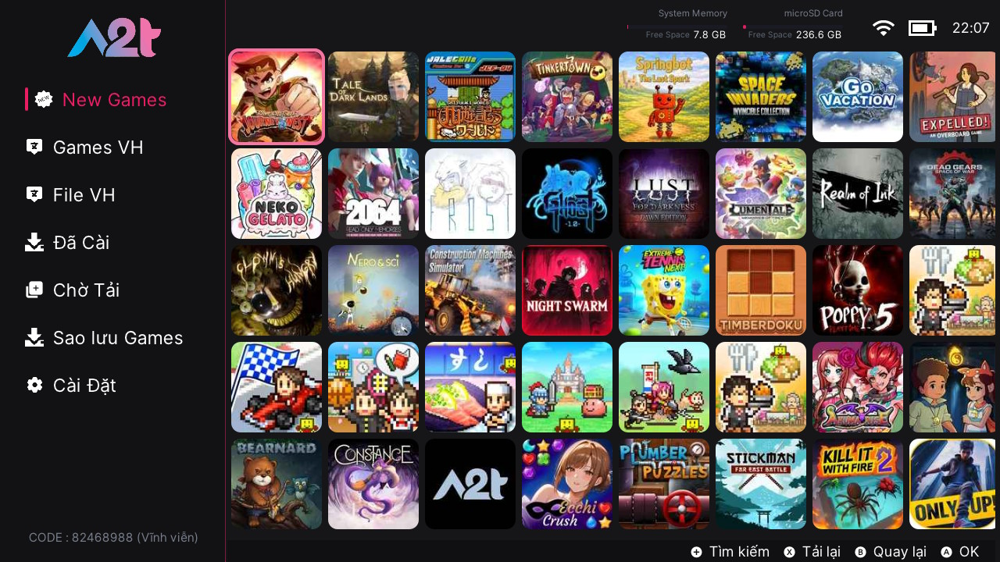
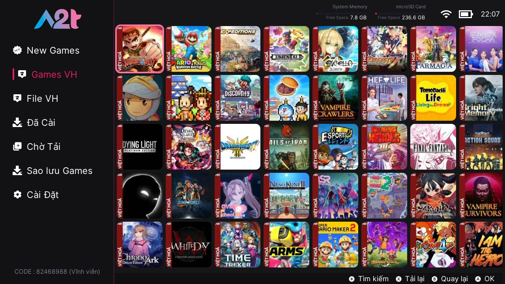
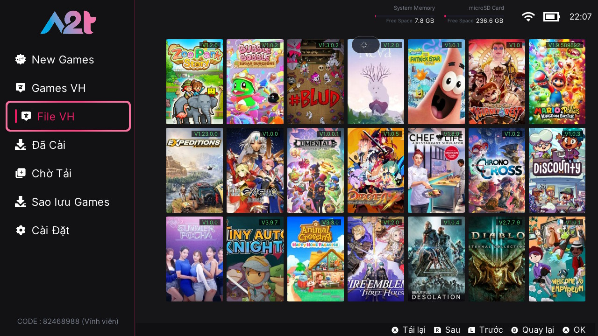

  

<h1 align="center">A2T GAMES</h1>

  <strong>Host Games Switch</strong> — ứng dụng trên Nintendo Switch để duyệt thư viện game và cài đặt trực tiếp từ máy chủ.

---

## Giới thiệu

A2T GAMES là cửa hàng game cho Switch, giao diện đơn giản, có tiếng Việt. Sau khi kích hoạt thiết bị, bạn có thể tìm game, tải và cài games NSP qua mạng một cách tự động.

## Tính năng chính

- **News Games** — tải và cài games mới
- **Chi tiết game** — cover, screenshot, mô tả, cài đặt một chạm
- **Games Việt hoá** — game VH và file patch tiếng Việt
- **Hàng chờ** — quản lý các lượt cài đang chạy
- **Save Cloud** — sao lưu và khôi phục save game lên server
- **Cài đặt** — đổi theme, ngôn ngữ, cập nhật app, sigpatches, gói icon offline

## Hình ảnh

| Trang chủ | Game VH | File VH |
|:---:|:---:|:---:|
|  |  |  |

## Yêu cầu
Nintendo Switch đã custom firmware, kết nối WiFi/LAN, và thiết bị được kích hoạt trên server.

---

  A2T GAMES · Host Games Switch

